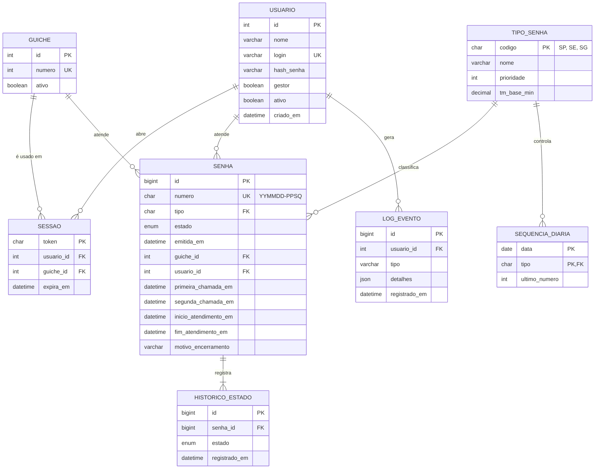

# Modelo Entidade-Relacionamento (MER)

Banco: **MySQL 8.0** (implementação prevista para a fase 2). Script: [`nassaudb.sql`](nassaudb.sql).

## Dicionário resumido
| Entidade | Descrição |
|----------|-----------|
| USUARIO | Atendentes. Apenas um possui `gestor = true` (RN14). |
| GUICHE | Guichês físicos; qualquer um atende qualquer tipo. |
| SESSAO | Login ativo do atendente em um guichê. |
| TIPO_SENHA | SP, SE e SG com prioridade e TM de referência. |
| SEQUENCIA_DIARIA | Último número usado por tipo e dia (reinício diário da numeração). |
| SENHA | Ticket e todos os horários usados na auditoria. |
| HISTORICO_ESTADO | Trilha de todas as transições da máquina de estados. |
| LOG_EVENTO | Eventos de segurança (login, falha, cadastro). |
