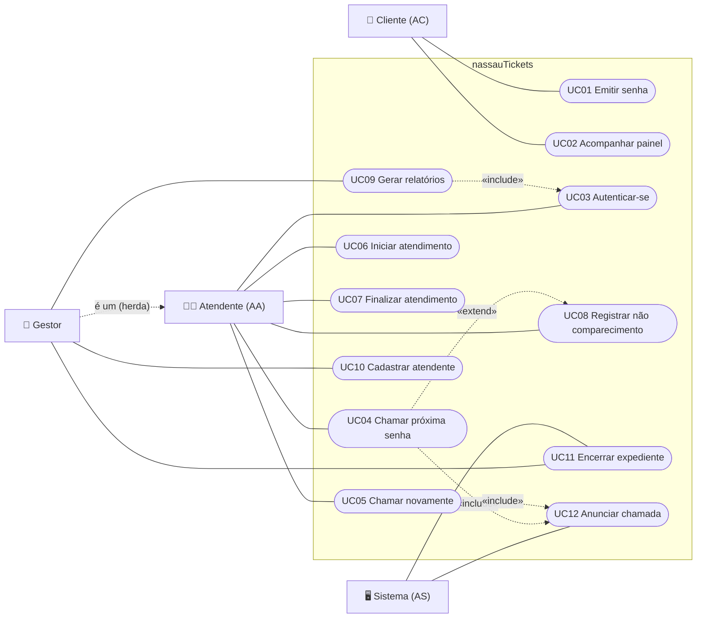

# Diagrama de Casos de Uso

> O GitHub desenha diagramas Mermaid automaticamente. Como o Mermaid não possui notação
> oficial de casos de uso, os atores estão representados à esquerda e os casos de uso como elipses.

