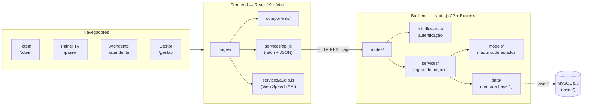

# Arquitetura (visão de componentes e implantação)

```mermaid
flowchart LR
    subgraph Clientes["Navegadores"]
        TOT["Totem<br/>/totem"]
        PAI["Painel TV<br/>/painel"]
        ATE["Atendente<br/>/atendente"]
        GES["Gestor<br/>/gestao"]
    end

    subgraph FE["Frontend — React 19 + Vite"]
        PAGES["pages/"] --> COMP["components/"]
        PAGES --> SERV["services/api.js<br/>(fetch + JSON)"]
        PAGES --> AUD["services/audio.js<br/>(Web Speech API)"]
    end

    subgraph BE["Backend — Node.js 22 + Express"]
        ROT["routes/"] --> MID["middlewares/<br/>autenticação"]
        ROT --> SVC["services/<br/>regras de negócio"]
        SVC --> MOD["models/<br/>máquina de estados"]
        SVC --> DATA["data/<br/>memória (fase 1)"]
    end

    DB[("MySQL 8.0<br/>(fase 2)")]

    Clientes --> FE
    SERV -- "HTTP REST /api" --> ROT
    DATA -. fase 2 .-> DB
```
