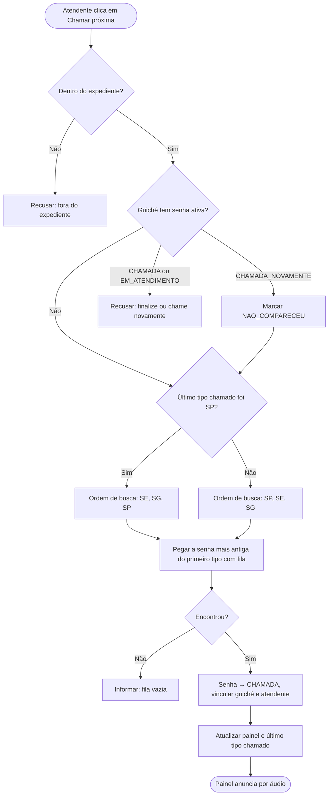

# Diagrama de Atividades — Escolha da próxima senha

```mermaid
flowchart TD
    A([Atendente clica em Chamar próxima]) --> B{Dentro do expediente?}
    B -- Não --> X[Recusar: fora do expediente]
    B -- Sim --> C{Guichê tem senha ativa?}
    C -- CHAMADA_NOVAMENTE --> D[Marcar NAO_COMPARECEU]
    C -- CHAMADA ou EM_ATENDIMENTO --> Y[Recusar: finalize ou chame novamente]
    C -- Não --> E
    D --> E{Último tipo chamado foi SP?}
    E -- Sim --> F[Ordem de busca: SE, SG, SP]
    E -- Não --> G[Ordem de busca: SP, SE, SG]
    F --> H[Pegar a senha mais antiga do primeiro tipo com fila]
    G --> H
    H --> I{Encontrou?}
    I -- Não --> Z[Informar: fila vazia]
    I -- Sim --> J[Senha → CHAMADA, vincular guichê e atendente]
    J --> K[Atualizar painel e último tipo chamado]
    K --> L([Painel anuncia por áudio])
```
