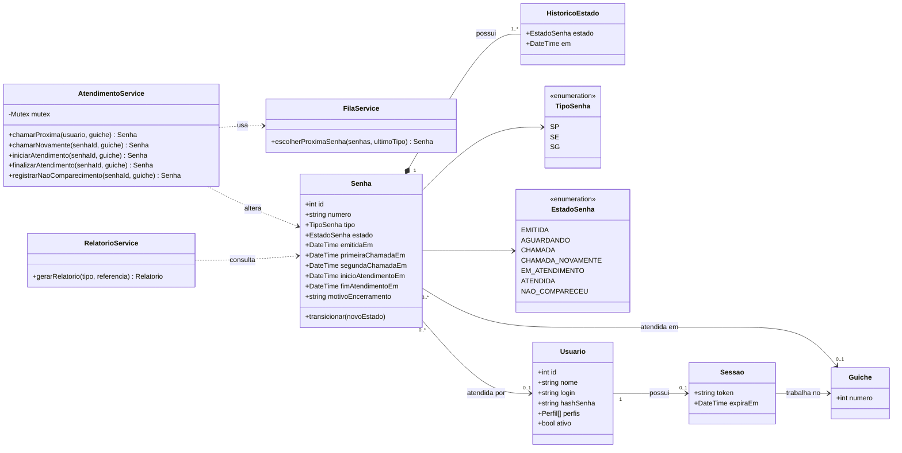

# Diagrama de Classes (modelo de domínio)

```mermaid
classDiagram
    direction LR

    class Senha {
        +int id
        +string numero
        +TipoSenha tipo
        +EstadoSenha estado
        +DateTime emitidaEm
        +DateTime primeiraChamadaEm
        +DateTime segundaChamadaEm
        +DateTime inicioAtendimentoEm
        +DateTime fimAtendimentoEm
        +string motivoEncerramento
        +transicionar(novoEstado)
    }

    class TipoSenha {
        <<enumeration>>
        SP
        SE
        SG
    }

    class EstadoSenha {
        <<enumeration>>
        EMITIDA
        AGUARDANDO
        CHAMADA
        CHAMADA_NOVAMENTE
        EM_ATENDIMENTO
        ATENDIDA
        NAO_COMPARECEU
    }

    class HistoricoEstado {
        +EstadoSenha estado
        +DateTime em
    }

    class Usuario {
        +int id
        +string nome
        +string login
        +string hashSenha
        +Perfil[] perfis
        +bool ativo
    }

    class Guiche {
        +int numero
    }

    class Sessao {
        +string token
        +DateTime expiraEm
    }

    class FilaService {
        +escolherProximaSenha(senhas, ultimoTipo) Senha
    }

    class AtendimentoService {
        -Mutex mutex
        +chamarProxima(usuario, guiche) Senha
        +chamarNovamente(senhaId, guiche) Senha
        +iniciarAtendimento(senhaId, guiche) Senha
        +finalizarAtendimento(senhaId, guiche) Senha
        +registrarNaoComparecimento(senhaId, guiche) Senha
    }

    class RelatorioService {
        +gerarRelatorio(tipo, referencia) Relatorio
    }

    Senha "1" *-- "1..*" HistoricoEstado : possui
    Senha --> TipoSenha
    Senha --> EstadoSenha
    Senha "0..*" --> "0..1" Guiche : atendida em
    Senha "0..*" --> "0..1" Usuario : atendida por
    Usuario "1" --> "0..1" Sessao : possui
    Sessao --> Guiche : trabalha no
    AtendimentoService ..> FilaService : usa
    AtendimentoService ..> Senha : altera
    RelatorioService ..> Senha : consulta
```
