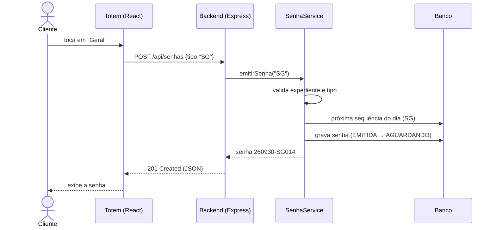
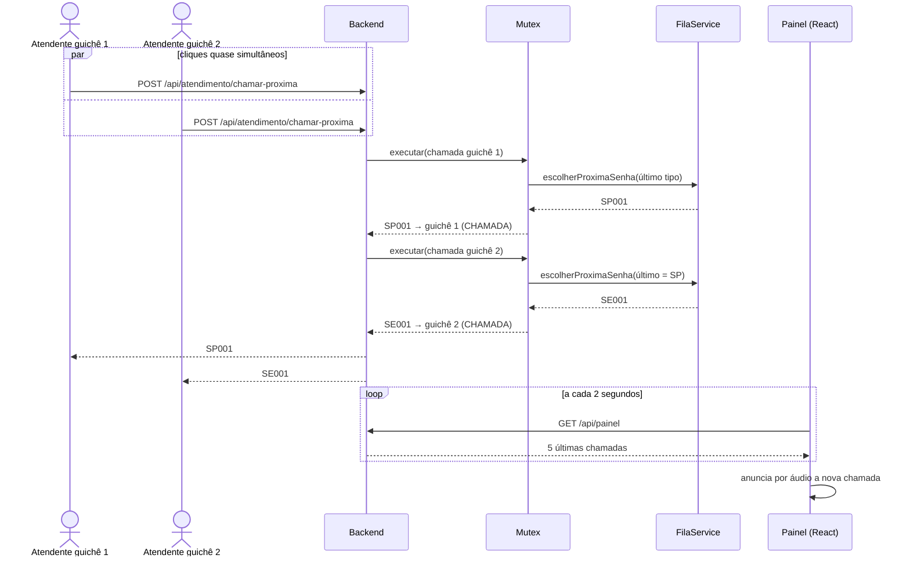
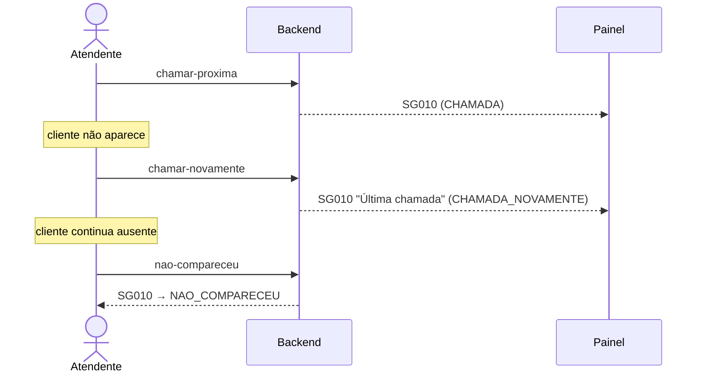

# Diagramas de Sequência

## 1. Emitir senha (UC01)

```mermaid
sequenceDiagram
    actor AC as Cliente
    participant T as Totem (React)
    participant API as Backend (Express)
    participant S as SenhaService
    participant DB as Banco

    AC->>T: toca em "Geral"
    T->>API: POST /api/senhas {tipo:"SG"}
    API->>S: emitirSenha("SG")
    S->>S: valida expediente e tipo
    S->>DB: próxima sequência do dia (SG)
    S->>DB: grava senha (EMITIDA → AGUARDANDO)
    S-->>API: senha 260930-SG014
    API-->>T: 201 Created (JSON)
    T-->>AC: exibe a senha
```

## 2. Chamar próxima senha com concorrência (UC04 + UC12)

```mermaid
sequenceDiagram
    actor A1 as Atendente guichê 1
    actor A2 as Atendente guichê 2
    participant API as Backend
    participant M as Mutex
    participant F as FilaService
    participant P as Painel (React)

    par cliques quase simultâneos
        A1->>API: POST /api/atendimento/chamar-proxima
    and
        A2->>API: POST /api/atendimento/chamar-proxima
    end
    API->>M: executar(chamada guichê 1)
    M->>F: escolherProximaSenha(último tipo)
    F-->>M: SP001
    M-->>API: SP001 → guichê 1 (CHAMADA)
    API->>M: executar(chamada guichê 2)
    M->>F: escolherProximaSenha(último = SP)
    F-->>M: SE001
    M-->>API: SE001 → guichê 2 (CHAMADA)
    API-->>A1: SP001
    API-->>A2: SE001
    loop a cada 2 segundos
        P->>API: GET /api/painel
        API-->>P: 5 últimas chamadas
    end
    P->>P: anuncia por áudio a nova chamada
```

## 3. Não comparecimento (UC05 + UC08)

```mermaid
sequenceDiagram
    actor AA as Atendente
    participant API as Backend
    participant P as Painel
    AA->>API: chamar-proxima
    API-->>P: SG010 (CHAMADA)
    Note over AA: cliente não aparece
    AA->>API: chamar-novamente
    API-->>P: SG010 "Última chamada" (CHAMADA_NOVAMENTE)
    Note over AA: cliente continua ausente
    AA->>API: nao-compareceu
    API-->>AA: SG010 → NAO_COMPARECEU
```
