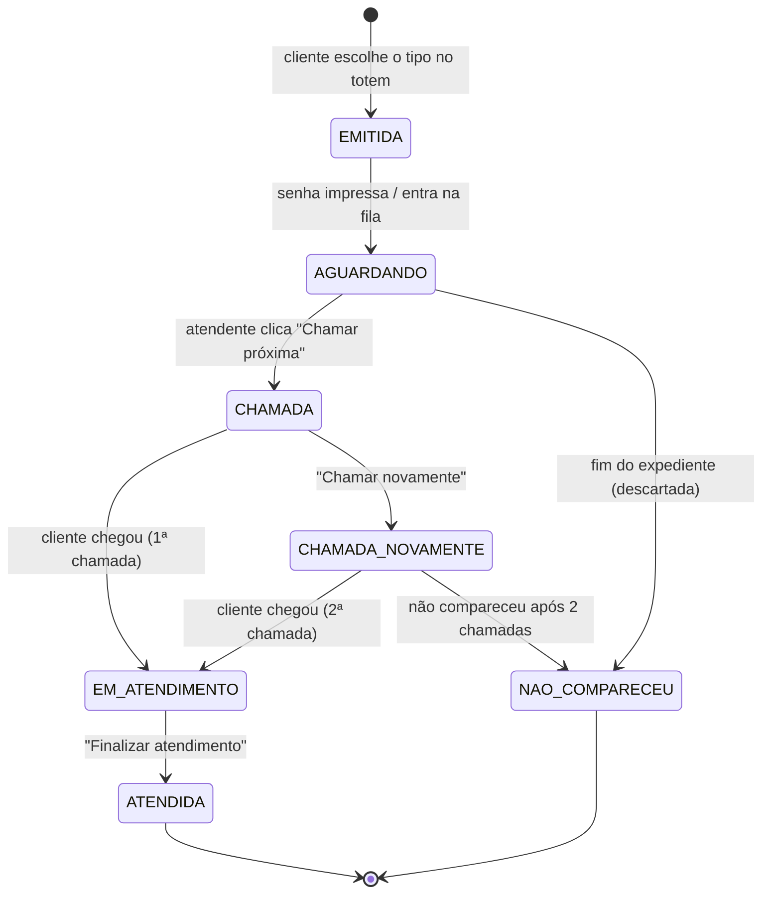

# Máquina de Estados da Senha

| Estado | Significado |
|--------|-------------|
| EMITIDA | Senha acabou de ser gerada no totem. |
| AGUARDANDO | Na fila, esperando ser chamada. |
| CHAMADA | Chamada no painel pela 1ª vez. |
| CHAMADA_NOVAMENTE | Chamada pela 2ª vez ("Última chamada"). |
| EM_ATENDIMENTO | Cliente está no guichê. |
| ATENDIDA | Atendimento finalizado. |
| NAO_COMPARECEU | Cliente não compareceu após 2 chamadas ou senha descartada no fim do expediente. |
